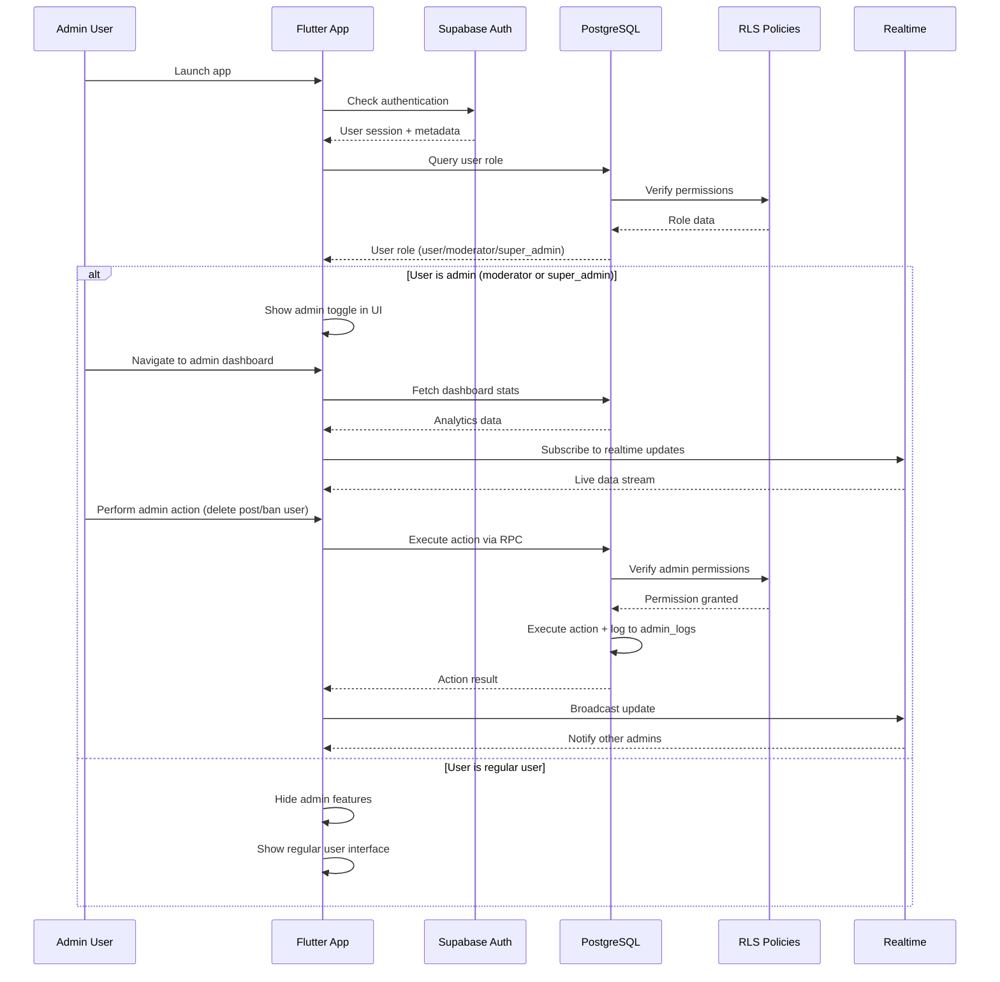
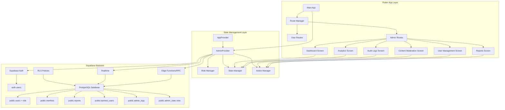
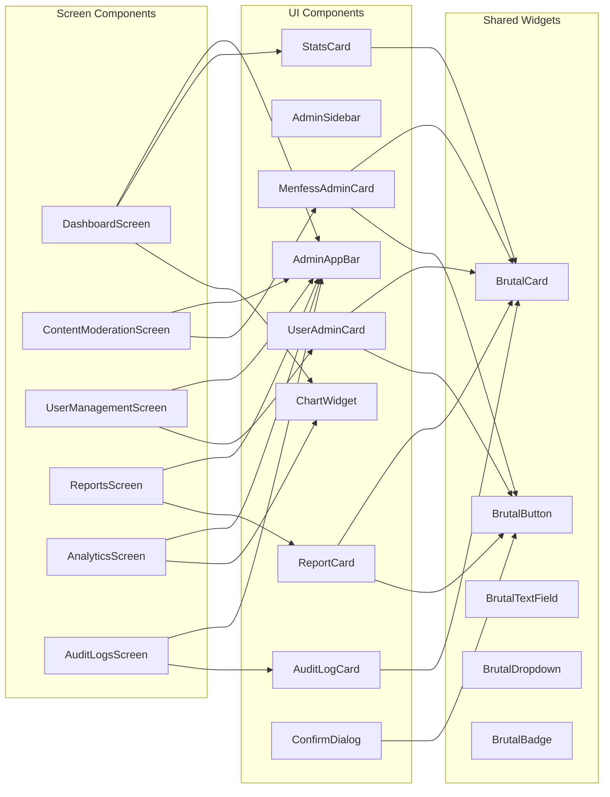
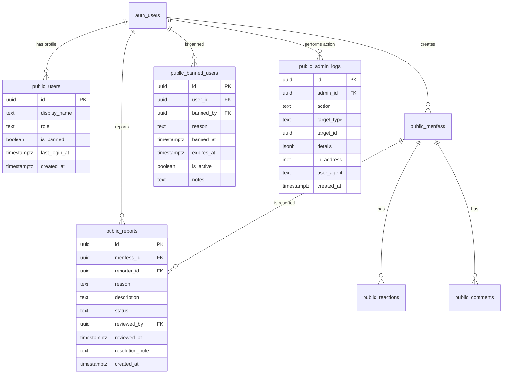

# Design Document: Admin Dashboard System

## Overview

The Admin Dashboard System is a comprehensive administrative interface for the Flutter Menfess app that enables role-based content moderation, user management, analytics, and audit logging. The system implements a three-tier role hierarchy (user, moderator, super_admin) with granular permissions, providing moderators and super admins with powerful tools to manage content, users, and monitor platform health while maintaining the app's Neo-Brutalism design aesthetic.

The dashboard is built as a separate navigation context within the existing Flutter app, leveraging Supabase for backend services (PostgreSQL database, Row Level Security policies, Realtime subscriptions, and Edge Functions). All admin actions are logged for compliance and accountability, with real-time updates for collaborative moderation workflows.

## Main Algorithm/Workflow



## Architecture

### System Architecture Diagram



### Component Architecture



## Database Schema

### Enhanced Users Table

```sql
-- Add role column to existing public.users table
ALTER TABLE public.users 
ADD COLUMN IF NOT EXISTS role TEXT DEFAULT 'user' CHECK (role IN ('user', 'moderator', 'super_admin'));

-- Add banned status
ALTER TABLE public.users 
ADD COLUMN IF NOT EXISTS is_banned BOOLEAN DEFAULT FALSE;

-- Add metadata
ALTER TABLE public.users 
ADD COLUMN IF NOT EXISTS last_login_at TIMESTAMPTZ;

-- Create index for role queries
CREATE INDEX IF NOT EXISTS idx_users_role ON public.users(role);
CREATE INDEX IF NOT EXISTS idx_users_banned ON public.users(is_banned);
```

### Reports Table

```sql
CREATE TABLE IF NOT EXISTS public.reports (
    id UUID PRIMARY KEY DEFAULT gen_random_uuid(),
    menfess_id UUID NOT NULL REFERENCES public.menfess(id) ON DELETE CASCADE,
    reporter_id UUID NOT NULL REFERENCES auth.users(id) ON DELETE CASCADE,
    reason TEXT NOT NULL CHECK (reason IN ('spam', 'harassment', 'inappropriate', 'misinformation', 'other')),
    description TEXT,
    status TEXT DEFAULT 'pending' CHECK (status IN ('pending', 'reviewing', 'resolved', 'dismissed')),
    reviewed_by UUID REFERENCES auth.users(id) ON DELETE SET NULL,
    reviewed_at TIMESTAMPTZ,
    resolution_note TEXT,
    created_at TIMESTAMPTZ DEFAULT NOW(),
    updated_at TIMESTAMPTZ DEFAULT NOW()
);

-- Indexes
CREATE INDEX idx_reports_status ON public.reports(status);
CREATE INDEX idx_reports_menfess ON public.reports(menfess_id);
CREATE INDEX idx_reports_reporter ON public.reports(reporter_id);
CREATE INDEX idx_reports_created ON public.reports(created_at DESC);

-- RLS Policies
ALTER TABLE public.reports ENABLE ROW LEVEL SECURITY;

-- Users can create reports
CREATE POLICY "Users can create reports"
ON public.reports FOR INSERT
WITH CHECK (auth.uid() = reporter_id);

-- Users can view their own reports
CREATE POLICY "Users can view own reports"
ON public.reports FOR SELECT
USING (auth.uid() = reporter_id);

-- Admins can view all reports
CREATE POLICY "Admins can view all reports"
ON public.reports FOR SELECT
USING (
    EXISTS (
        SELECT 1 FROM public.users 
        WHERE id = auth.uid() 
        AND role IN ('moderator', 'super_admin')
    )
);

-- Admins can update reports
CREATE POLICY "Admins can update reports"
ON public.reports FOR UPDATE
USING (
    EXISTS (
        SELECT 1 FROM public.users 
        WHERE id = auth.uid() 
        AND role IN ('moderator', 'super_admin')
    )
);
```

### Banned Users Table

```sql
CREATE TABLE IF NOT EXISTS public.banned_users (
    id UUID PRIMARY KEY DEFAULT gen_random_uuid(),
    user_id UUID NOT NULL REFERENCES auth.users(id) ON DELETE CASCADE,
    banned_by UUID NOT NULL REFERENCES auth.users(id) ON DELETE SET NULL,
    reason TEXT NOT NULL,
    banned_at TIMESTAMPTZ DEFAULT NOW(),
    expires_at TIMESTAMPTZ, -- NULL means permanent ban
    is_active BOOLEAN DEFAULT TRUE,
    notes TEXT,
    UNIQUE(user_id, is_active)
);

-- Indexes
CREATE INDEX idx_banned_users_user ON public.banned_users(user_id);
CREATE INDEX idx_banned_users_active ON public.banned_users(is_active);
CREATE INDEX idx_banned_users_expires ON public.banned_users(expires_at);

-- RLS Policies
ALTER TABLE public.banned_users ENABLE ROW LEVEL SECURITY;

-- Only admins can view bans
CREATE POLICY "Admins can view bans"
ON public.banned_users FOR SELECT
USING (
    EXISTS (
        SELECT 1 FROM public.users 
        WHERE id = auth.uid() 
        AND role IN ('moderator', 'super_admin')
    )
);

-- Only admins can create bans
CREATE POLICY "Admins can create bans"
ON public.banned_users FOR INSERT
WITH CHECK (
    EXISTS (
        SELECT 1 FROM public.users 
        WHERE id = auth.uid() 
        AND role IN ('moderator', 'super_admin')
    )
);

-- Only admins can update bans
CREATE POLICY "Admins can update bans"
ON public.banned_users FOR UPDATE
USING (
    EXISTS (
        SELECT 1 FROM public.users 
        WHERE id = auth.uid() 
        AND role IN ('moderator', 'super_admin')
    )
);
```

### Admin Logs Table

```sql
CREATE TABLE IF NOT EXISTS public.admin_logs (
    id UUID PRIMARY KEY DEFAULT gen_random_uuid(),
    admin_id UUID NOT NULL REFERENCES auth.users(id) ON DELETE SET NULL,
    action TEXT NOT NULL CHECK (action IN (
        'delete_menfess', 'ban_user', 'unban_user', 'change_role', 
        'resolve_report', 'dismiss_report', 'delete_comment'
    )),
    target_type TEXT NOT NULL CHECK (target_type IN ('menfess', 'user', 'comment', 'report')),
    target_id UUID NOT NULL,
    details JSONB,
    ip_address INET,
    user_agent TEXT,
    created_at TIMESTAMPTZ DEFAULT NOW()
);

-- Indexes
CREATE INDEX idx_admin_logs_admin ON public.admin_logs(admin_id);
CREATE INDEX idx_admin_logs_action ON public.admin_logs(action);
CREATE INDEX idx_admin_logs_created ON public.admin_logs(created_at DESC);
CREATE INDEX idx_admin_logs_target ON public.admin_logs(target_type, target_id);

-- RLS Policies
ALTER TABLE public.admin_logs ENABLE ROW LEVEL SECURITY;

-- Only admins can view logs
CREATE POLICY "Admins can view logs"
ON public.admin_logs FOR SELECT
USING (
    EXISTS (
        SELECT 1 FROM public.users 
        WHERE id = auth.uid() 
        AND role IN ('moderator', 'super_admin')
    )
);

-- System can insert logs (via triggers/functions)
CREATE POLICY "System can insert logs"
ON public.admin_logs FOR INSERT
WITH CHECK (true);
```

### Admin Stats View

```sql
CREATE OR REPLACE VIEW public.admin_stats AS
SELECT
    -- User stats
    (SELECT COUNT(*) FROM auth.users) AS total_users,
    (SELECT COUNT(*) FROM auth.users WHERE created_at >= NOW() - INTERVAL '24 hours') AS users_today,
    (SELECT COUNT(*) FROM auth.users WHERE created_at >= NOW() - INTERVAL '7 days') AS users_this_week,
    (SELECT COUNT(*) FROM public.users WHERE last_login_at >= NOW() - INTERVAL '24 hours') AS active_users_today,
    (SELECT COUNT(*) FROM public.users WHERE is_banned = TRUE) AS banned_users_count,
    
    -- Menfess stats
    (SELECT COUNT(*) FROM public.menfess) AS total_menfess,
    (SELECT COUNT(*) FROM public.menfess WHERE created_at >= NOW() - INTERVAL '24 hours') AS menfess_today,
    (SELECT COUNT(*) FROM public.menfess WHERE created_at >= NOW() - INTERVAL '7 days') AS menfess_this_week,
    
    -- Engagement stats
    (SELECT COUNT(*) FROM public.reactions) AS total_reactions,
    (SELECT COUNT(*) FROM public.reactions WHERE created_at >= NOW() - INTERVAL '24 hours') AS reactions_today,
    (SELECT COUNT(*) FROM public.comments) AS total_comments,
    (SELECT COUNT(*) FROM public.comments WHERE created_at >= NOW() - INTERVAL '24 hours') AS comments_today,
    
    -- Report stats
    (SELECT COUNT(*) FROM public.reports WHERE status = 'pending') AS pending_reports,
    (SELECT COUNT(*) FROM public.reports WHERE status = 'reviewing') AS reviewing_reports,
    (SELECT COUNT(*) FROM public.reports WHERE created_at >= NOW() - INTERVAL '24 hours') AS reports_today,
    
    -- Admin activity
    (SELECT COUNT(*) FROM public.admin_logs WHERE created_at >= NOW() - INTERVAL '24 hours') AS admin_actions_today;

-- Grant access to admins
GRANT SELECT ON public.admin_stats TO authenticated;
```

### Database Relationships Diagram



## Core Interfaces/Types

### Dart Models

```dart
// Admin Role Enum
enum UserRole {
  user,
  moderator,
  superAdmin;
  
  String get value {
    switch (this) {
      case UserRole.user:
        return 'user';
      case UserRole.moderator:
        return 'moderator';
      case UserRole.superAdmin:
        return 'super_admin';
    }
  }
  
  static UserRole fromString(String value) {
    switch (value) {
      case 'moderator':
        return UserRole.moderator;
      case 'super_admin':
        return UserRole.superAdmin;
      default:
        return UserRole.user;
    }
  }
  
  bool get isAdmin => this == UserRole.moderator || this == UserRole.superAdmin;
  bool get isSuperAdmin => this == UserRole.superAdmin;
}

// Report Model
class ReportModel {
  final String id;
  final String menfessId;
  final String reporterId;
  final String reason;
  final String? description;
  final String status;
  final String? reviewedBy;
  final DateTime? reviewedAt;
  final String? resolutionNote;
  final DateTime createdAt;
  final DateTime updatedAt;
  
  // Populated fields
  final MenfessModel? menfess;
  final String? reporterDisplayName;
  final String? reviewerDisplayName;
  
  const ReportModel({
    required this.id,
    required this.menfessId,
    required this.reporterId,
    required this.reason,
    this.description,
    required this.status,
    this.reviewedBy,
    this.reviewedAt,
    this.resolutionNote,
    required this.createdAt,
    required this.updatedAt,
    this.menfess,
    this.reporterDisplayName,
    this.reviewerDisplayName,
  });
  
  factory ReportModel.fromMap(Map<String, dynamic> map) {
    return ReportModel(
      id: map['id'] as String,
      menfessId: map['menfess_id'] as String,
      reporterId: map['reporter_id'] as String,
      reason: map['reason'] as String,
      description: map['description'] as String?,
      status: map['status'] as String,
      reviewedBy: map['reviewed_by'] as String?,
      reviewedAt: map['reviewed_at'] != null 
          ? DateTime.parse(map['reviewed_at'] as String) 
          : null,
      resolutionNote: map['resolution_note'] as String?,
      createdAt: DateTime.parse(map['created_at'] as String),
      updatedAt: DateTime.parse(map['updated_at'] as String),
      menfess: map['menfess'] != null 
          ? MenfessModel.fromMap(map['menfess'] as Map<String, dynamic>) 
          : null,
      reporterDisplayName: map['reporter_display_name'] as String?,
      reviewerDisplayName: map['reviewer_display_name'] as String?,
    );
  }
}

// Banned User Model
class BannedUserModel {
  final String id;
  final String userId;
  final String bannedBy;
  final String reason;
  final DateTime bannedAt;
  final DateTime? expiresAt;
  final bool isActive;
  final String? notes;
  
  // Populated fields
  final String? userDisplayName;
  final String? bannedByDisplayName;
  
  const BannedUserModel({
    required this.id,
    required this.userId,
    required this.bannedBy,
    required this.reason,
    required this.bannedAt,
    this.expiresAt,
    required this.isActive,
    this.notes,
    this.userDisplayName,
    this.bannedByDisplayName,
  });
  
  factory BannedUserModel.fromMap(Map<String, dynamic> map) {
    return BannedUserModel(
      id: map['id'] as String,
      userId: map['user_id'] as String,
      bannedBy: map['banned_by'] as String,
      reason: map['reason'] as String,
      bannedAt: DateTime.parse(map['banned_at'] as String),
      expiresAt: map['expires_at'] != null 
          ? DateTime.parse(map['expires_at'] as String) 
          : null,
      isActive: map['is_active'] as bool,
      notes: map['notes'] as String?,
      userDisplayName: map['user_display_name'] as String?,
      bannedByDisplayName: map['banned_by_display_name'] as String?,
    );
  }
  
  bool get isPermanent => expiresAt == null;
  bool get isExpired => expiresAt != null && DateTime.now().isAfter(expiresAt!);
}

// Admin Log Model
class AdminLogModel {
  final String id;
  final String adminId;
  final String action;
  final String targetType;
  final String targetId;
  final Map<String, dynamic>? details;
  final String? ipAddress;
  final String? userAgent;
  final DateTime createdAt;
  
  // Populated fields
  final String? adminDisplayName;
  
  const AdminLogModel({
    required this.id,
    required this.adminId,
    required this.action,
    required this.targetType,
    required this.targetId,
    this.details,
    this.ipAddress,
    this.userAgent,
    required this.createdAt,
    this.adminDisplayName,
  });
  
  factory AdminLogModel.fromMap(Map<String, dynamic> map) {
    return AdminLogModel(
      id: map['id'] as String,
      adminId: map['admin_id'] as String,
      action: map['action'] as String,
      targetType: map['target_type'] as String,
      targetId: map['target_id'] as String,
      details: map['details'] as Map<String, dynamic>?,
      ipAddress: map['ip_address'] as String?,
      userAgent: map['user_agent'] as String?,
      createdAt: DateTime.parse(map['created_at'] as String),
      adminDisplayName: map['admin_display_name'] as String?,
    );
  }
}

// Admin Stats Model
class AdminStatsModel {
  final int totalUsers;
  final int usersToday;
  final int usersThisWeek;
  final int activeUsersToday;
  final int bannedUsersCount;
  final int totalMenfess;
  final int menfessToday;
  final int menfessThisWeek;
  final int totalReactions;
  final int reactionsToday;
  final int totalComments;
  final int commentsToday;
  final int pendingReports;
  final int reviewingReports;
  final int reportsToday;
  final int adminActionsToday;
  
  const AdminStatsModel({
    required this.totalUsers,
    required this.usersToday,
    required this.usersThisWeek,
    required this.activeUsersToday,
    required this.bannedUsersCount,
    required this.totalMenfess,
    required this.menfessToday,
    required this.menfessThisWeek,
    required this.totalReactions,
    required this.reactionsToday,
    required this.totalComments,
    required this.commentsToday,
    required this.pendingReports,
    required this.reviewingReports,
    required this.reportsToday,
    required this.adminActionsToday,
  });
  
  factory AdminStatsModel.fromMap(Map<String, dynamic> map) {
    return AdminStatsModel(
      totalUsers: (map['total_users'] as num).toInt(),
      usersToday: (map['users_today'] as num).toInt(),
      usersThisWeek: (map['users_this_week'] as num).toInt(),
      activeUsersToday: (map['active_users_today'] as num).toInt(),
      bannedUsersCount: (map['banned_users_count'] as num).toInt(),
      totalMenfess: (map['total_menfess'] as num).toInt(),
      menfessToday: (map['menfess_today'] as num).toInt(),
      menfessThisWeek: (map['menfess_this_week'] as num).toInt(),
      totalReactions: (map['total_reactions'] as num).toInt(),
      reactionsToday: (map['reactions_today'] as num).toInt(),
      totalComments: (map['total_comments'] as num).toInt(),
      commentsToday: (map['comments_today'] as num).toInt(),
      pendingReports: (map['pending_reports'] as num).toInt(),
      reviewingReports: (map['reviewing_reports'] as num).toInt(),
      reportsToday: (map['reports_today'] as num).toInt(),
      adminActionsToday: (map['admin_actions_today'] as num).toInt(),
    );
  }
}

// User Admin Model (extended user info for admin panel)
class UserAdminModel {
  final String id;
  final String? displayName;
  final UserRole role;
  final bool isBanned;
  final DateTime? lastLoginAt;
  final DateTime createdAt;
  
  // Aggregated stats
  final int menfessCount;
  final int commentsCount;
  final int reactionsCount;
  final int reportsReceived;
  final int reportsMade;
  
  const UserAdminModel({
    required this.id,
    this.displayName,
    required this.role,
    required this.isBanned,
    this.lastLoginAt,
    required this.createdAt,
    required this.menfessCount,
    required this.commentsCount,
    required this.reactionsCount,
    required this.reportsReceived,
    required this.reportsMade,
  });
  
  factory UserAdminModel.fromMap(Map<String, dynamic> map) {
    return UserAdminModel(
      id: map['id'] as String,
      displayName: map['display_name'] as String?,
      role: UserRole.fromString(map['role'] as String? ?? 'user'),
      isBanned: map['is_banned'] as bool? ?? false,
      lastLoginAt: map['last_login_at'] != null 
          ? DateTime.parse(map['last_login_at'] as String) 
          : null,
      createdAt: DateTime.parse(map['created_at'] as String),
      menfessCount: (map['menfess_count'] as num?)?.toInt() ?? 0,
      commentsCount: (map['comments_count'] as num?)?.toInt() ?? 0,
      reactionsCount: (map['reactions_count'] as num?)?.toInt() ?? 0,
      reportsReceived: (map['reports_received'] as num?)?.toInt() ?? 0,
      reportsMade: (map['reports_made'] as num?)?.toInt() ?? 0,
    );
  }
}
```

## Key Functions with Formal Specifications

### AdminProvider Class

```dart
class AdminProvider extends ChangeNotifier {
  final SupabaseClient _supabase;
  
  // State
  UserRole? _currentUserRole;
  AdminStatsModel? _stats;
  List<ReportModel> _reports = [];
  List<UserAdminModel> _users = [];
  List<AdminLogModel> _logs = [];
  bool _isLoading = false;
  String? _error;
  
  // Getters
  UserRole? get currentUserRole => _currentUserRole;
  bool get isAdmin => _currentUserRole?.isAdmin ?? false;
  bool get isSuperAdmin => _currentUserRole?.isSuperAdmin ?? false;
  AdminStatsModel? get stats => _stats;
  List<ReportModel> get reports => _reports;
  List<UserAdminModel> get users => _users;
  List<AdminLogModel> get logs => _logs;
  bool get isLoading => _isLoading;
  String? get error => _error;
  
  AdminProvider(this._supabase);
  
  /// Initialize admin provider and fetch user role
  /// 
  /// Preconditions:
  /// - User must be authenticated
  /// - Supabase client must be initialized
  /// 
  /// Postconditions:
  /// - _currentUserRole is set to user's role from database
  /// - If user is admin, stats are fetched
  /// - Realtime subscriptions are established for admin users
  Future<void> initialize() async {
    try {
      _isLoading = true;
      _error = null;
      notifyListeners();
      
      final userId = _supabase.auth.currentUser?.id;
      if (userId == null) {
        throw Exception('User not authenticated');
      }
      
      // Fetch user role
      final response = await _supabase
          .from('users')
          .select('role')
          .eq('id', userId)
          .single();
      
      _currentUserRole = UserRole.fromString(response['role'] as String);
      
      // If admin, fetch initial data
      if (isAdmin) {
        await fetchStats();
        _setupRealtimeSubscriptions();
      }
      
      _isLoading = false;
      notifyListeners();
    } catch (e) {
      _error = e.toString();
      _isLoading = false;
      notifyListeners();
    }
  }
  
  /// Fetch dashboard statistics
  /// 
  /// Preconditions:
  /// - User must be admin (moderator or super_admin)
  /// - Database view admin_stats must exist
  /// 
  /// Postconditions:
  /// - _stats contains current platform statistics
  /// - _error is null if successful, error message otherwise
  Future<void> fetchStats() async {
    if (!isAdmin) return;
    
    try {
      final response = await _supabase
          .from('admin_stats')
          .select()
          .single();
      
      _stats = AdminStatsModel.fromMap(response);
      _error = null;
      notifyListeners();
    } catch (e) {
      _error = 'Failed to fetch stats: $e';
      notifyListeners();
    }
  }
  
  /// Delete a menfess post (admin action)
  /// 
  /// Preconditions:
  /// - User must be admin
  /// - menfessId must be valid UUID
  /// - Menfess must exist in database
  /// 
  /// Postconditions:
  /// - Menfess is deleted from database
  /// - Admin action is logged in admin_logs table
  /// - Related data (reactions, comments, reports) are cascade deleted
  /// - Returns true if successful, false otherwise
  Future<bool> deleteMenfess(String menfessId, String reason) async {
    if (!isAdmin) return false;
    
    try {
      await _supabase.rpc('admin_delete_menfess', params: {
        'menfess_id': menfessId,
        'reason': reason,
      });
      
      await fetchStats();
      return true;
    } catch (e) {
      _error = 'Failed to delete menfess: $e';
      notifyListeners();
      return false;
    }
  }
  
  /// Ban a user
  /// 
  /// Preconditions:
  /// - User must be admin
  /// - targetUserId must be valid UUID and exist
  /// - Target user cannot be super_admin (unless caller is super_admin)
  /// - expiresAt must be in future if provided
  /// 
  /// Postconditions:
  /// - User is marked as banned in users table
  /// - Ban record is created in banned_users table
  /// - Admin action is logged
  /// - Returns true if successful
  Future<bool> banUser({
    required String targetUserId,
    required String reason,
    DateTime? expiresAt,
    String? notes,
  }) async {
    if (!isAdmin) return false;
    
    try {
      await _supabase.rpc('admin_ban_user', params: {
        'target_user_id': targetUserId,
        'reason': reason,
        'expires_at': expiresAt?.toIso8601String(),
        'notes': notes,
      });
      
      await fetchStats();
      return true;
    } catch (e) {
      _error = 'Failed to ban user: $e';
      notifyListeners();
      return false;
    }
  }
  
  /// Unban a user
  /// 
  /// Preconditions:
  /// - User must be admin
  /// - targetUserId must be currently banned
  /// 
  /// Postconditions:
  /// - User is_banned flag set to false
  /// - Active ban record is deactivated
  /// - Admin action is logged
  Future<bool> unbanUser(String targetUserId) async {
    if (!isAdmin) return false;
    
    try {
      await _supabase.rpc('admin_unban_user', params: {
        'target_user_id': targetUserId,
      });
      
      await fetchStats();
      return true;
    } catch (e) {
      _error = 'Failed to unban user: $e';
      notifyListeners();
      return false;
    }
  }
  
  /// Change user role
  /// 
  /// Preconditions:
  /// - User must be super_admin
  /// - targetUserId must exist
  /// - newRole must be valid UserRole
  /// - Cannot change own role
  /// 
  /// Postconditions:
  /// - Target user's role is updated
  /// - Admin action is logged
  Future<bool> changeUserRole(String targetUserId, UserRole newRole) async {
    if (!isSuperAdmin) return false;
    
    final currentUserId = _supabase.auth.currentUser?.id;
    if (currentUserId == targetUserId) {
      _error = 'Cannot change your own role';
      notifyListeners();
      return false;
    }
    
    try {
      await _supabase.rpc('admin_change_role', params: {
        'target_user_id': targetUserId,
        'new_role': newRole.value,
      });
      
      return true;
    } catch (e) {
      _error = 'Failed to change role: $e';
      notifyListeners();
      return false;
    }
  }
  
  /// Resolve a report
  /// 
  /// Preconditions:
  /// - User must be admin
  /// - reportId must exist
  /// - Report status must be 'pending' or 'reviewing'
  /// 
  /// Postconditions:
  /// - Report status updated to 'resolved'
  /// - reviewed_by and reviewed_at fields populated
  /// - resolution_note saved
  /// - Admin action logged
  Future<bool> resolveReport(String reportId, String resolutionNote) async {
    if (!isAdmin) return false;
    
    try {
      await _supabase.rpc('admin_resolve_report', params: {
        'report_id': reportId,
        'resolution_note': resolutionNote,
      });
      
      await fetchReports();
      await fetchStats();
      return true;
    } catch (e) {
      _error = 'Failed to resolve report: $e';
      notifyListeners();
      return false;
    }
  }
  
  /// Fetch all reports with filters
  /// 
  /// Preconditions:
  /// - User must be admin
  /// 
  /// Postconditions:
  /// - _reports contains filtered list of reports
  /// - Reports are ordered by created_at DESC
  Future<void> fetchReports({String? status}) async {
    if (!isAdmin) return;
    
    try {
      _isLoading = true;
      notifyListeners();
      
      var query = _supabase
          .from('reports')
          .select('''
            *,
            menfess:menfess_id(*),
            reporter:reporter_id(display_name),
            reviewer:reviewed_by(display_name)
          ''')
          .order('created_at', ascending: false);
      
      if (status != null) {
        query = query.eq('status', status);
      }
      
      final response = await query;
      _reports = (response as List)
          .map((e) => ReportModel.fromMap(e as Map<String, dynamic>))
          .toList();
      
      _isLoading = false;
      _error = null;
      notifyListeners();
    } catch (e) {
      _error = 'Failed to fetch reports: $e';
      _isLoading = false;
      notifyListeners();
    }
  }
  
  /// Fetch users with admin info
  /// 
  /// Preconditions:
  /// - User must be admin
  /// 
  /// Postconditions:
  /// - _users contains list of users with aggregated stats
  Future<void> fetchUsers({String? searchQuery, UserRole? roleFilter}) async {
    if (!isAdmin) return;
    
    try {
      _isLoading = true;
      notifyListeners();
      
      // Use RPC function to get users with aggregated stats
      final response = await _supabase.rpc('admin_get_users', params: {
        'search_query': searchQuery,
        'role_filter': roleFilter?.value,
      });
      
      _users = (response as List)
          .map((e) => UserAdminModel.fromMap(e as Map<String, dynamic>))
          .toList();
      
      _isLoading = false;
      _error = null;
      notifyListeners();
    } catch (e) {
      _error = 'Failed to fetch users: $e';
      _isLoading = false;
      notifyListeners();
    }
  }
  
  /// Fetch admin logs
  /// 
  /// Preconditions:
  /// - User must be admin
  /// 
  /// Postconditions:
  /// - _logs contains recent admin actions
  Future<void> fetchLogs({String? actionFilter, int limit = 100}) async {
    if (!isAdmin) return;
    
    try {
      _isLoading = true;
      notifyListeners();
      
      var query = _supabase
          .from('admin_logs')
          .select('''
            *,
            admin:admin_id(display_name)
          ''')
          .order('created_at', ascending: false)
          .limit(limit);
      
      if (actionFilter != null) {
        query = query.eq('action', actionFilter);
      }
      
      final response = await query;
      _logs = (response as List)
          .map((e) => AdminLogModel.fromMap(e as Map<String, dynamic>))
          .toList();
      
      _isLoading = false;
      _error = null;
      notifyListeners();
    } catch (e) {
      _error = 'Failed to fetch logs: $e';
      _isLoading = false;
      notifyListeners();
    }
  }
  
  /// Setup realtime subscriptions for admin data
  /// 
  /// Preconditions:
  /// - User must be admin
  /// - Realtime must be enabled on tables
  /// 
  /// Postconditions:
  /// - Subscriptions established for reports, admin_logs
  /// - UI updates automatically when data changes
  void _setupRealtimeSubscriptions() {
    // Subscribe to reports changes
    _supabase
        .channel('admin_reports')
        .onPostgresChanges(
          event: PostgresChangeEvent.all,
          schema: 'public',
          table: 'reports',
          callback: (payload) {
            fetchReports();
            fetchStats();
          },
        )
        .subscribe();
    
    // Subscribe to admin logs
    _supabase
        .channel('admin_logs')
        .onPostgresChanges(
          event: PostgresChangeEvent.insert,
          schema: 'public',
          table: 'admin_logs',
          callback: (payload) {
            fetchLogs();
          },
        )
        .subscribe();
  }
}
```


## Algorithmic Pseudocode

### Admin Action with Logging Algorithm

```pascal
ALGORITHM executeAdminAction(action, targetType, targetId, details)
INPUT: 
  action: String (action type)
  targetType: String (target entity type)
  targetId: UUID (target entity ID)
  details: Map (additional action details)
OUTPUT: 
  result: Boolean (success/failure)

PRECONDITIONS:
  - Current user is authenticated
  - Current user has admin role (moderator or super_admin)
  - targetId references existing entity
  - action is valid admin action type

POSTCONDITIONS:
  - If successful: action is executed and logged
  - If failed: error is set and no changes made
  - Admin log entry created with timestamp and user info

BEGIN
  ASSERT currentUser IS NOT NULL
  ASSERT currentUser.role IN ['moderator', 'super_admin']
  
  BEGIN TRANSACTION
    TRY
      // Execute the specific action
      CASE action OF
        'delete_menfess':
          DELETE FROM menfess WHERE id = targetId
          
        'ban_user':
          UPDATE users SET is_banned = TRUE WHERE id = targetId
          INSERT INTO banned_users (user_id, banned_by, reason, ...)
          VALUES (targetId, currentUser.id, details.reason, ...)
          
        'unban_user':
          UPDATE users SET is_banned = FALSE WHERE id = targetId
          UPDATE banned_users SET is_active = FALSE 
          WHERE user_id = targetId AND is_active = TRUE
          
        'change_role':
          ASSERT currentUser.role = 'super_admin'
          ASSERT targetId != currentUser.id
          UPDATE users SET role = details.newRole WHERE id = targetId
          
        'resolve_report':
          UPDATE reports SET 
            status = 'resolved',
            reviewed_by = currentUser.id,
            reviewed_at = NOW(),
            resolution_note = details.note
          WHERE id = targetId
          
        'dismiss_report':
          UPDATE reports SET 
            status = 'dismissed',
            reviewed_by = currentUser.id,
            reviewed_at = NOW()
          WHERE id = targetId
      END CASE
      
      // Log the action
      INSERT INTO admin_logs (
        admin_id, action, target_type, target_id, 
        details, ip_address, user_agent, created_at
      ) VALUES (
        currentUser.id, action, targetType, targetId,
        details, currentRequest.ipAddress, currentRequest.userAgent, NOW()
      )
      
      COMMIT TRANSACTION
      RETURN TRUE
      
    CATCH error
      ROLLBACK TRANSACTION
      SET errorMessage = error.message
      RETURN FALSE
    END TRY
  END TRANSACTION
END
```

### Report Processing Algorithm

```pascal
ALGORITHM processReport(reportId, action, resolutionNote)
INPUT:
  reportId: UUID (report to process)
  action: String ('resolve', 'dismiss', or 'delete_content')
  resolutionNote: String (admin's note)
OUTPUT:
  success: Boolean

PRECONDITIONS:
  - User is admin
  - Report exists and status is 'pending' or 'reviewing'
  - resolutionNote is non-empty for 'resolve' action

POSTCONDITIONS:
  - Report status updated
  - If action is 'delete_content', associated menfess is deleted
  - Admin action logged
  - Report creator notified (optional)

BEGIN
  ASSERT currentUser.isAdmin = TRUE
  
  report ← FETCH report FROM reports WHERE id = reportId
  ASSERT report IS NOT NULL
  ASSERT report.status IN ['pending', 'reviewing']
  
  BEGIN TRANSACTION
    // Update report status
    IF action = 'resolve' THEN
      UPDATE reports SET
        status = 'resolved',
        reviewed_by = currentUser.id,
        reviewed_at = NOW(),
        resolution_note = resolutionNote
      WHERE id = reportId
      
    ELSE IF action = 'dismiss' THEN
      UPDATE reports SET
        status = 'dismissed',
        reviewed_by = currentUser.id,
        reviewed_at = NOW(),
        resolution_note = resolutionNote
      WHERE id = reportId
      
    ELSE IF action = 'delete_content' THEN
      // Delete the reported menfess
      DELETE FROM menfess WHERE id = report.menfess_id
      
      // Mark report as resolved
      UPDATE reports SET
        status = 'resolved',
        reviewed_by = currentUser.id,
        reviewed_at = NOW(),
        resolution_note = 'Content deleted: ' + resolutionNote
      WHERE id = reportId
    END IF
    
    // Log admin action
    INSERT INTO admin_logs (
      admin_id, action, target_type, target_id, details
    ) VALUES (
      currentUser.id, 
      'process_report', 
      'report', 
      reportId,
      JSON_BUILD_OBJECT('action', action, 'note', resolutionNote)
    )
    
    COMMIT TRANSACTION
    RETURN TRUE
    
  CATCH error
    ROLLBACK TRANSACTION
    RETURN FALSE
  END TRANSACTION
END
```

### User Ban Management Algorithm

```pascal
ALGORITHM manageBan(userId, action, reason, expiresAt, notes)
INPUT:
  userId: UUID (user to ban/unban)
  action: String ('ban' or 'unban')
  reason: String (ban reason)
  expiresAt: DateTime (optional, NULL for permanent)
  notes: String (optional admin notes)
OUTPUT:
  success: Boolean

PRECONDITIONS:
  - Current user is admin
  - userId exists and is not current user
  - If banning super_admin, current user must be super_admin
  - expiresAt is in future if provided

POSTCONDITIONS:
  - User ban status updated
  - Ban record created/deactivated in banned_users table
  - Admin action logged
  - User's active sessions invalidated (for ban)

BEGIN
  ASSERT currentUser.isAdmin = TRUE
  
  targetUser ← FETCH user FROM users WHERE id = userId
  ASSERT targetUser IS NOT NULL
  ASSERT userId != currentUser.id
  
  // Super admin protection
  IF targetUser.role = 'super_admin' THEN
    ASSERT currentUser.role = 'super_admin'
  END IF
  
  BEGIN TRANSACTION
    IF action = 'ban' THEN
      // Check if already banned
      existingBan ← FETCH FROM banned_users 
        WHERE user_id = userId AND is_active = TRUE
      
      IF existingBan IS NOT NULL THEN
        RETURN FALSE  // Already banned
      END IF
      
      // Create ban record
      INSERT INTO banned_users (
        user_id, banned_by, reason, banned_at, 
        expires_at, is_active, notes
      ) VALUES (
        userId, currentUser.id, reason, NOW(),
        expiresAt, TRUE, notes
      )
      
      // Update user status
      UPDATE users SET is_banned = TRUE WHERE id = userId
      
      // Invalidate user sessions (via Supabase Auth API)
      CALL supabase.auth.admin.signOut(userId)
      
      // Log action
      INSERT INTO admin_logs (
        admin_id, action, target_type, target_id, details
      ) VALUES (
        currentUser.id, 'ban_user', 'user', userId,
        JSON_BUILD_OBJECT(
          'reason', reason, 
          'expires_at', expiresAt,
          'permanent', expiresAt IS NULL
        )
      )
      
    ELSE IF action = 'unban' THEN
      // Deactivate ban record
      UPDATE banned_users 
      SET is_active = FALSE 
      WHERE user_id = userId AND is_active = TRUE
      
      // Update user status
      UPDATE users SET is_banned = FALSE WHERE id = userId
      
      // Log action
      INSERT INTO admin_logs (
        admin_id, action, target_type, target_id, details
      ) VALUES (
        currentUser.id, 'unban_user', 'user', userId, NULL
      )
    END IF
    
    COMMIT TRANSACTION
    RETURN TRUE
    
  CATCH error
    ROLLBACK TRANSACTION
    RETURN FALSE
  END TRANSACTION
END
```

### Dashboard Stats Calculation Algorithm

```pascal
ALGORITHM calculateDashboardStats()
INPUT: None
OUTPUT: AdminStatsModel (aggregated statistics)

PRECONDITIONS:
  - User is admin
  - Database tables exist and are accessible

POSTCONDITIONS:
  - Returns current platform statistics
  - All counts are accurate as of query time
  - No side effects on database

BEGIN
  ASSERT currentUser.isAdmin = TRUE
  
  stats ← NEW AdminStatsModel()
  
  // User statistics
  stats.totalUsers ← COUNT(*) FROM auth.users
  stats.usersToday ← COUNT(*) FROM auth.users 
    WHERE created_at >= NOW() - INTERVAL '24 hours'
  stats.usersThisWeek ← COUNT(*) FROM auth.users 
    WHERE created_at >= NOW() - INTERVAL '7 days'
  stats.activeUsersToday ← COUNT(*) FROM users 
    WHERE last_login_at >= NOW() - INTERVAL '24 hours'
  stats.bannedUsersCount ← COUNT(*) FROM users WHERE is_banned = TRUE
  
  // Content statistics
  stats.totalMenfess ← COUNT(*) FROM menfess
  stats.menfessToday ← COUNT(*) FROM menfess 
    WHERE created_at >= NOW() - INTERVAL '24 hours'
  stats.menfessThisWeek ← COUNT(*) FROM menfess 
    WHERE created_at >= NOW() - INTERVAL '7 days'
  
  // Engagement statistics
  stats.totalReactions ← COUNT(*) FROM reactions
  stats.reactionsToday ← COUNT(*) FROM reactions 
    WHERE created_at >= NOW() - INTERVAL '24 hours'
  stats.totalComments ← COUNT(*) FROM comments
  stats.commentsToday ← COUNT(*) FROM comments 
    WHERE created_at >= NOW() - INTERVAL '24 hours'
  
  // Report statistics
  stats.pendingReports ← COUNT(*) FROM reports WHERE status = 'pending'
  stats.reviewingReports ← COUNT(*) FROM reports WHERE status = 'reviewing'
  stats.reportsToday ← COUNT(*) FROM reports 
    WHERE created_at >= NOW() - INTERVAL '24 hours'
  
  // Admin activity
  stats.adminActionsToday ← COUNT(*) FROM admin_logs 
    WHERE created_at >= NOW() - INTERVAL '24 hours'
  
  RETURN stats
END
```

### Bulk User Action Algorithm

```pascal
ALGORITHM bulkUserAction(userIds, action, params)
INPUT:
  userIds: List<UUID> (users to act upon)
  action: String ('ban', 'unban', 'change_role', 'delete')
  params: Map (action-specific parameters)
OUTPUT:
  results: Map<UUID, Boolean> (success status per user)

PRECONDITIONS:
  - Current user is admin (super_admin for role changes)
  - userIds list is non-empty and contains valid UUIDs
  - Current user ID not in userIds list
  - params contains required fields for action

POSTCONDITIONS:
  - Action applied to all valid users
  - Each action logged separately
  - Returns success/failure status for each user
  - Partial success possible (some succeed, some fail)

BEGIN
  ASSERT currentUser.isAdmin = TRUE
  ASSERT userIds IS NOT EMPTY
  ASSERT currentUser.id NOT IN userIds
  
  results ← NEW Map<UUID, Boolean>()
  
  FOR EACH userId IN userIds DO
    ASSERT NOT (userId IN results)  // No duplicates
    
    TRY
      CASE action OF
        'ban':
          success ← manageBan(
            userId, 'ban', 
            params.reason, params.expiresAt, params.notes
          )
          
        'unban':
          success ← manageBan(userId, 'unban', NULL, NULL, NULL)
          
        'change_role':
          ASSERT currentUser.role = 'super_admin'
          success ← changeUserRole(userId, params.newRole)
          
        'delete':
          ASSERT currentUser.role = 'super_admin'
          BEGIN TRANSACTION
            DELETE FROM users WHERE id = userId
            // Cascade deletes handle related data
            COMMIT TRANSACTION
          END TRANSACTION
          success ← TRUE
      END CASE
      
      results[userId] ← success
      
    CATCH error
      results[userId] ← FALSE
    END TRY
  END FOR
  
  RETURN results
END
```

## Example Usage

### Admin Dashboard Screen Example

```dart
class AdminDashboardScreen extends StatefulWidget {
  final AdminProvider adminProvider;
  
  const AdminDashboardScreen({
    super.key,
    required this.adminProvider,
  });
  
  @override
  State<AdminDashboardScreen> createState() => _AdminDashboardScreenState();
}

class _AdminDashboardScreenState extends State<AdminDashboardScreen> {
  @override
  void initState() {
    super.initState();
    widget.adminProvider.fetchStats();
  }
  
  @override
  Widget build(BuildContext context) {
    return Scaffold(
      backgroundColor: NeoBrutalismTheme.white,
      body: SafeArea(
        child: Column(
          children: [
            // Admin App Bar
            _buildAdminAppBar(),
            
            // Stats Grid
            Expanded(
              child: ListenableBuilder(
                listenable: widget.adminProvider,
                builder: (context, _) {
                  if (widget.adminProvider.isLoading) {
                    return const Center(
                      child: CircularProgressIndicator(
                        color: NeoBrutalismTheme.blue,
                      ),
                    );
                  }
                  
                  final stats = widget.adminProvider.stats;
                  if (stats == null) {
                    return const Center(
                      child: Text('No stats available'),
                    );
                  }
                  
                  return RefreshIndicator(
                    onRefresh: widget.adminProvider.fetchStats,
                    child: SingleChildScrollView(
                      padding: const EdgeInsets.all(16),
                      child: Column(
                        crossAxisAlignment: CrossAxisAlignment.start,
                        children: [
                          // Overview Section
                          _buildSectionHeader('OVERVIEW'),
                          const SizedBox(height: 12),
                          _buildStatsGrid([
                            _StatData(
                              'Total Users',
                              stats.totalUsers,
                              Icons.people,
                              NeoBrutalismTheme.blue,
                            ),
                            _StatData(
                              'Active Today',
                              stats.activeUsersToday,
                              Icons.online_prediction,
                              NeoBrutalismTheme.green,
                            ),
                            _StatData(
                              'Total Posts',
                              stats.totalMenfess,
                              Icons.article,
                              NeoBrutalismTheme.yellow,
                            ),
                            _StatData(
                              'Pending Reports',
                              stats.pendingReports,
                              Icons.flag,
                              NeoBrutalismTheme.red,
                            ),
                          ]),
                          
                          const SizedBox(height: 24),
                          
                          // Today's Activity
                          _buildSectionHeader('TODAY\'S ACTIVITY'),
                          const SizedBox(height: 12),
                          _buildStatsGrid([
                            _StatData(
                              'New Users',
                              stats.usersToday,
                              Icons.person_add,
                              NeoBrutalismTheme.blue,
                            ),
                            _StatData(
                              'New Posts',
                              stats.menfessToday,
                              Icons.add_circle,
                              NeoBrutalismTheme.yellow,
                            ),
                            _StatData(
                              'Reactions',
                              stats.reactionsToday,
                              Icons.favorite,
                              NeoBrutalismTheme.red,
                            ),
                            _StatData(
                              'Comments',
                              stats.commentsToday,
                              Icons.comment,
                              NeoBrutalismTheme.purple,
                            ),
                          ]),
                          
                          const SizedBox(height: 24),
                          
                          // Quick Actions
                          _buildSectionHeader('QUICK ACTIONS'),
                          const SizedBox(height: 12),
                          _buildQuickActions(),
                        ],
                      ),
                    ),
                  );
                },
              ),
            ),
          ],
        ),
      ),
    );
  }
  
  Widget _buildAdminAppBar() {
    return Container(
      padding: const EdgeInsets.all(16),
      decoration: BoxDecoration(
        color: NeoBrutalismTheme.yellow,
        border: Border(
          bottom: BorderSide(
            color: NeoBrutalismTheme.black,
            width: NeoBrutalismTheme.borderWidth,
          ),
        ),
      ),
      child: Row(
        children: [
          Container(
            width: 44,
            height: 44,
            decoration: BoxDecoration(
              color: NeoBrutalismTheme.black,
              border: Border.all(
                color: NeoBrutalismTheme.black,
                width: NeoBrutalismTheme.borderWidthThin,
              ),
            ),
            child: const Icon(
              Icons.admin_panel_settings,
              size: 24,
              color: NeoBrutalismTheme.yellow,
            ),
          ),
          const SizedBox(width: 12),
          Text(
            'ADMIN DASHBOARD',
            style: GoogleFonts.spaceGrotesk(
              fontSize: 20,
              fontWeight: FontWeight.w900,
              color: NeoBrutalismTheme.black,
              letterSpacing: 1.0,
            ),
          ),
          const Spacer(),
          _BrutalIconButton(
            icon: Icons.exit_to_app,
            bgColor: NeoBrutalismTheme.white,
            onTap: () => Navigator.pop(context),
          ),
        ],
      ),
    );
  }
  
  Widget _buildSectionHeader(String title) {
    return Container(
      padding: const EdgeInsets.symmetric(horizontal: 12, vertical: 8),
      decoration: BoxDecoration(
        color: NeoBrutalismTheme.black,
        border: Border.all(
          color: NeoBrutalismTheme.black,
          width: NeoBrutalismTheme.borderWidthThin,
        ),
      ),
      child: Text(
        title,
        style: GoogleFonts.spaceGrotesk(
          fontSize: 14,
          fontWeight: FontWeight.w900,
          color: NeoBrutalismTheme.yellow,
          letterSpacing: 1.0,
        ),
      ),
    );
  }
  
  Widget _buildStatsGrid(List<_StatData> stats) {
    return GridView.builder(
      shrinkWrap: true,
      physics: const NeverScrollableScrollPhysics(),
      gridDelegate: const SliverGridDelegateWithFixedCrossAxisCount(
        crossAxisCount: 2,
        crossAxisSpacing: 12,
        mainAxisSpacing: 12,
        childAspectRatio: 1.5,
      ),
      itemCount: stats.length,
      itemBuilder: (context, index) {
        final stat = stats[index];
        return _StatsCard(
          label: stat.label,
          value: stat.value,
          icon: stat.icon,
          color: stat.color,
        );
      },
    );
  }
  
  Widget _buildQuickActions() {
    return Column(
      children: [
        _QuickActionButton(
          label: 'VIEW REPORTS',
          icon: Icons.flag,
          color: NeoBrutalismTheme.red,
          onTap: () {
            // Navigate to reports screen
          },
        ),
        const SizedBox(height: 12),
        _QuickActionButton(
          label: 'MANAGE USERS',
          icon: Icons.people,
          color: NeoBrutalismTheme.blue,
          onTap: () {
            // Navigate to user management
          },
        ),
        const SizedBox(height: 12),
        _QuickActionButton(
          label: 'VIEW AUDIT LOGS',
          icon: Icons.history,
          color: NeoBrutalismTheme.purple,
          onTap: () {
            // Navigate to audit logs
          },
        ),
      ],
    );
  }
}

class _StatData {
  final String label;
  final int value;
  final IconData icon;
  final Color color;
  
  _StatData(this.label, this.value, this.icon, this.color);
}

class _StatsCard extends StatelessWidget {
  final String label;
  final int value;
  final IconData icon;
  final Color color;
  
  const _StatsCard({
    required this.label,
    required this.value,
    required this.icon,
    required this.color,
  });
  
  @override
  Widget build(BuildContext context) {
    return Container(
      padding: const EdgeInsets.all(16),
      decoration: BoxDecoration(
        color: NeoBrutalismTheme.white,
        border: Border.all(
          color: NeoBrutalismTheme.black,
          width: NeoBrutalismTheme.borderWidth,
        ),
        boxShadow: [NeoBrutalismTheme.hardShadow()],
      ),
      child: Column(
        crossAxisAlignment: CrossAxisAlignment.start,
        mainAxisAlignment: MainAxisAlignment.spaceBetween,
        children: [
          Row(
            children: [
              Container(
                padding: const EdgeInsets.all(8),
                decoration: BoxDecoration(
                  color: color,
                  border: Border.all(
                    color: NeoBrutalismTheme.black,
                    width: 2,
                  ),
                ),
                child: Icon(
                  icon,
                  size: 20,
                  color: NeoBrutalismTheme.white,
                ),
              ),
            ],
          ),
          Column(
            crossAxisAlignment: CrossAxisAlignment.start,
            children: [
              Text(
                value.toString(),
                style: GoogleFonts.spaceGrotesk(
                  fontSize: 28,
                  fontWeight: FontWeight.w900,
                  color: NeoBrutalismTheme.black,
                  height: 1.0,
                ),
              ),
              const SizedBox(height: 4),
              Text(
                label,
                style: GoogleFonts.spaceGrotesk(
                  fontSize: 11,
                  fontWeight: FontWeight.w700,
                  color: NeoBrutalismTheme.black,
                  letterSpacing: 0.5,
                ),
              ),
            ],
          ),
        ],
      ),
    );
  }
}

class _QuickActionButton extends StatefulWidget {
  final String label;
  final IconData icon;
  final Color color;
  final VoidCallback onTap;
  
  const _QuickActionButton({
    required this.label,
    required this.icon,
    required this.color,
    required this.onTap,
  });
  
  @override
  State<_QuickActionButton> createState() => _QuickActionButtonState();
}

class _QuickActionButtonState extends State<_QuickActionButton> {
  bool _pressed = false;
  
  @override
  Widget build(BuildContext context) {
    return GestureDetector(
      onTapDown: (_) => setState(() => _pressed = true),
      onTapUp: (_) {
        setState(() => _pressed = false);
        widget.onTap();
      },
      onTapCancel: () => setState(() => _pressed = false),
      child: AnimatedContainer(
        duration: const Duration(milliseconds: 100),
        width: double.infinity,
        padding: const EdgeInsets.all(16),
        margin: EdgeInsets.only(
          top: _pressed ? 4 : 0,
          left: _pressed ? 4 : 0,
        ),
        decoration: BoxDecoration(
          color: widget.color,
          border: Border.all(
            color: NeoBrutalismTheme.black,
            width: NeoBrutalismTheme.borderWidth,
          ),
          boxShadow: _pressed ? [] : [NeoBrutalismTheme.hardShadow()],
        ),
        child: Row(
          children: [
            Icon(
              widget.icon,
              size: 24,
              color: NeoBrutalismTheme.white,
            ),
            const SizedBox(width: 12),
            Text(
              widget.label,
              style: GoogleFonts.spaceGrotesk(
                fontSize: 16,
                fontWeight: FontWeight.w900,
                color: NeoBrutalismTheme.white,
                letterSpacing: 1.0,
              ),
            ),
            const Spacer(),
            const Icon(
              Icons.arrow_forward,
              size: 20,
              color: NeoBrutalismTheme.white,
            ),
          ],
        ),
      ),
    );
  }
}
```

### Delete Menfess with Confirmation Example

```dart
Future<void> _showDeleteConfirmation(
  BuildContext context,
  MenfessModel menfess,
  AdminProvider adminProvider,
) async {
  final confirmed = await showDialog<bool>(
    context: context,
    builder: (context) => _BrutalConfirmDialog(
      title: 'DELETE MENFESS',
      message: 'Are you sure you want to delete this menfess? This action cannot be undone.',
      confirmText: 'DELETE',
      confirmColor: NeoBrutalismTheme.red,
      cancelText: 'CANCEL',
    ),
  );
  
  if (confirmed == true) {
    final reasonController = TextEditingController();
    final reasonConfirmed = await showDialog<bool>(
      context: context,
      builder: (context) => _BrutalInputDialog(
        title: 'DELETE REASON',
        message: 'Please provide a reason for deleting this menfess:',
        controller: reasonController,
        confirmText: 'DELETE',
        confirmColor: NeoBrutalismTheme.red,
      ),
    );
    
    if (reasonConfirmed == true && reasonController.text.isNotEmpty) {
      final success = await adminProvider.deleteMenfess(
        menfess.id,
        reasonController.text,
      );
      
      if (success && context.mounted) {
        ScaffoldMessenger.of(context).showSnackBar(
          SnackBar(
            content: Text(
              'Menfess deleted successfully',
              style: GoogleFonts.spaceGrotesk(
                fontWeight: FontWeight.w700,
              ),
            ),
            backgroundColor: NeoBrutalismTheme.green,
          ),
        );
      }
    }
  }
}

class _BrutalConfirmDialog extends StatelessWidget {
  final String title;
  final String message;
  final String confirmText;
  final Color confirmColor;
  final String cancelText;
  
  const _BrutalConfirmDialog({
    required this.title,
    required this.message,
    required this.confirmText,
    required this.confirmColor,
    required this.cancelText,
  });
  
  @override
  Widget build(BuildContext context) {
    return Dialog(
      backgroundColor: Colors.transparent,
      child: Container(
        padding: const EdgeInsets.all(20),
        decoration: BoxDecoration(
          color: NeoBrutalismTheme.white,
          border: Border.all(
            color: NeoBrutalismTheme.black,
            width: NeoBrutalismTheme.borderWidth,
          ),
          boxShadow: [NeoBrutalismTheme.hardShadow(offsetX: 8, offsetY: 8)],
        ),
        child: Column(
          mainAxisSize: MainAxisSize.min,
          crossAxisAlignment: CrossAxisAlignment.start,
          children: [
            Text(
              title,
              style: GoogleFonts.spaceGrotesk(
                fontSize: 20,
                fontWeight: FontWeight.w900,
                color: NeoBrutalismTheme.black,
                letterSpacing: 1.0,
              ),
            ),
            const SizedBox(height: 16),
            Text(
              message,
              style: GoogleFonts.spaceGrotesk(
                fontSize: 15,
                fontWeight: FontWeight.w600,
                color: NeoBrutalismTheme.black,
                height: 1.5,
              ),
            ),
            const SizedBox(height: 24),
            Row(
              children: [
                Expanded(
                  child: _BrutalButton(
                    label: cancelText,
                    color: NeoBrutalismTheme.white,
                    textColor: NeoBrutalismTheme.black,
                    onTap: () => Navigator.pop(context, false),
                  ),
                ),
                const SizedBox(width: 12),
                Expanded(
                  child: _BrutalButton(
                    label: confirmText,
                    color: confirmColor,
                    textColor: NeoBrutalismTheme.white,
                    onTap: () => Navigator.pop(context, true),
                  ),
                ),
              ],
            ),
          ],
        ),
      ),
    );
  }
}
```


## Supabase RPC Functions

### admin_delete_menfess

```sql
CREATE OR REPLACE FUNCTION admin_delete_menfess(
  menfess_id UUID,
  reason TEXT
)
RETURNS void
LANGUAGE plpgsql
SECURITY DEFINER
AS $$
DECLARE
  admin_role TEXT;
BEGIN
  -- Check if caller is admin
  SELECT role INTO admin_role FROM public.users WHERE id = auth.uid();
  
  IF admin_role NOT IN ('moderator', 'super_admin') THEN
    RAISE EXCEPTION 'Unauthorized: Admin access required';
  END IF;
  
  -- Delete the menfess (cascade will handle related data)
  DELETE FROM public.menfess WHERE id = menfess_id;
  
  -- Log the action
  INSERT INTO public.admin_logs (
    admin_id, action, target_type, target_id, details
  ) VALUES (
    auth.uid(), 
    'delete_menfess', 
    'menfess', 
    menfess_id,
    jsonb_build_object('reason', reason)
  );
END;
$$;
```

### admin_ban_user

```sql
CREATE OR REPLACE FUNCTION admin_ban_user(
  target_user_id UUID,
  reason TEXT,
  expires_at TIMESTAMPTZ DEFAULT NULL,
  notes TEXT DEFAULT NULL
)
RETURNS void
LANGUAGE plpgsql
SECURITY DEFINER
AS $$
DECLARE
  admin_role TEXT;
  target_role TEXT;
BEGIN
  -- Check if caller is admin
  SELECT role INTO admin_role FROM public.users WHERE id = auth.uid();
  
  IF admin_role NOT IN ('moderator', 'super_admin') THEN
    RAISE EXCEPTION 'Unauthorized: Admin access required';
  END IF;
  
  -- Get target user role
  SELECT role INTO target_role FROM public.users WHERE id = target_user_id;
  
  -- Super admin protection
  IF target_role = 'super_admin' AND admin_role != 'super_admin' THEN
    RAISE EXCEPTION 'Unauthorized: Cannot ban super admin';
  END IF;
  
  -- Cannot ban self
  IF target_user_id = auth.uid() THEN
    RAISE EXCEPTION 'Cannot ban yourself';
  END IF;
  
  -- Check if already banned
  IF EXISTS (
    SELECT 1 FROM public.banned_users 
    WHERE user_id = target_user_id AND is_active = TRUE
  ) THEN
    RAISE EXCEPTION 'User is already banned';
  END IF;
  
  -- Create ban record
  INSERT INTO public.banned_users (
    user_id, banned_by, reason, banned_at, expires_at, is_active, notes
  ) VALUES (
    target_user_id, auth.uid(), reason, NOW(), expires_at, TRUE, notes
  );
  
  -- Update user status
  UPDATE public.users SET is_banned = TRUE WHERE id = target_user_id;
  
  -- Log the action
  INSERT INTO public.admin_logs (
    admin_id, action, target_type, target_id, details
  ) VALUES (
    auth.uid(), 
    'ban_user', 
    'user', 
    target_user_id,
    jsonb_build_object(
      'reason', reason,
      'expires_at', expires_at,
      'permanent', expires_at IS NULL
    )
  );
END;
$$;
```

### admin_unban_user

```sql
CREATE OR REPLACE FUNCTION admin_unban_user(
  target_user_id UUID
)
RETURNS void
LANGUAGE plpgsql
SECURITY DEFINER
AS $$
DECLARE
  admin_role TEXT;
BEGIN
  -- Check if caller is admin
  SELECT role INTO admin_role FROM public.users WHERE id = auth.uid();
  
  IF admin_role NOT IN ('moderator', 'super_admin') THEN
    RAISE EXCEPTION 'Unauthorized: Admin access required';
  END IF;
  
  -- Deactivate ban record
  UPDATE public.banned_users 
  SET is_active = FALSE 
  WHERE user_id = target_user_id AND is_active = TRUE;
  
  -- Update user status
  UPDATE public.users SET is_banned = FALSE WHERE id = target_user_id;
  
  -- Log the action
  INSERT INTO public.admin_logs (
    admin_id, action, target_type, target_id, details
  ) VALUES (
    auth.uid(), 'unban_user', 'user', target_user_id, NULL
  );
END;
$$;
```

### admin_change_role

```sql
CREATE OR REPLACE FUNCTION admin_change_role(
  target_user_id UUID,
  new_role TEXT
)
RETURNS void
LANGUAGE plpgsql
SECURITY DEFINER
AS $$
DECLARE
  admin_role TEXT;
BEGIN
  -- Check if caller is super admin
  SELECT role INTO admin_role FROM public.users WHERE id = auth.uid();
  
  IF admin_role != 'super_admin' THEN
    RAISE EXCEPTION 'Unauthorized: Super admin access required';
  END IF;
  
  -- Cannot change own role
  IF target_user_id = auth.uid() THEN
    RAISE EXCEPTION 'Cannot change your own role';
  END IF;
  
  -- Validate new role
  IF new_role NOT IN ('user', 'moderator', 'super_admin') THEN
    RAISE EXCEPTION 'Invalid role: %', new_role;
  END IF;
  
  -- Update user role
  UPDATE public.users SET role = new_role WHERE id = target_user_id;
  
  -- Log the action
  INSERT INTO public.admin_logs (
    admin_id, action, target_type, target_id, details
  ) VALUES (
    auth.uid(), 
    'change_role', 
    'user', 
    target_user_id,
    jsonb_build_object('new_role', new_role)
  );
END;
$$;
```

### admin_resolve_report

```sql
CREATE OR REPLACE FUNCTION admin_resolve_report(
  report_id UUID,
  resolution_note TEXT
)
RETURNS void
LANGUAGE plpgsql
SECURITY DEFINER
AS $$
DECLARE
  admin_role TEXT;
BEGIN
  -- Check if caller is admin
  SELECT role INTO admin_role FROM public.users WHERE id = auth.uid();
  
  IF admin_role NOT IN ('moderator', 'super_admin') THEN
    RAISE EXCEPTION 'Unauthorized: Admin access required';
  END IF;
  
  -- Update report
  UPDATE public.reports 
  SET 
    status = 'resolved',
    reviewed_by = auth.uid(),
    reviewed_at = NOW(),
    resolution_note = resolution_note,
    updated_at = NOW()
  WHERE id = report_id;
  
  -- Log the action
  INSERT INTO public.admin_logs (
    admin_id, action, target_type, target_id, details
  ) VALUES (
    auth.uid(), 
    'resolve_report', 
    'report', 
    report_id,
    jsonb_build_object('resolution_note', resolution_note)
  );
END;
$$;
```

### admin_dismiss_report

```sql
CREATE OR REPLACE FUNCTION admin_dismiss_report(
  report_id UUID
)
RETURNS void
LANGUAGE plpgsql
SECURITY DEFINER
AS $$
DECLARE
  admin_role TEXT;
BEGIN
  -- Check if caller is admin
  SELECT role INTO admin_role FROM public.users WHERE id = auth.uid();
  
  IF admin_role NOT IN ('moderator', 'super_admin') THEN
    RAISE EXCEPTION 'Unauthorized: Admin access required';
  END IF;
  
  -- Update report
  UPDATE public.reports 
  SET 
    status = 'dismissed',
    reviewed_by = auth.uid(),
    reviewed_at = NOW(),
    updated_at = NOW()
  WHERE id = report_id;
  
  -- Log the action
  INSERT INTO public.admin_logs (
    admin_id, action, target_type, target_id, details
  ) VALUES (
    auth.uid(), 'dismiss_report', 'report', report_id, NULL
  );
END;
$$;
```

### admin_get_users

```sql
CREATE OR REPLACE FUNCTION admin_get_users(
  search_query TEXT DEFAULT NULL,
  role_filter TEXT DEFAULT NULL
)
RETURNS TABLE (
  id UUID,
  display_name TEXT,
  role TEXT,
  is_banned BOOLEAN,
  last_login_at TIMESTAMPTZ,
  created_at TIMESTAMPTZ,
  menfess_count BIGINT,
  comments_count BIGINT,
  reactions_count BIGINT,
  reports_received BIGINT,
  reports_made BIGINT
)
LANGUAGE plpgsql
SECURITY DEFINER
AS $$
DECLARE
  admin_role TEXT;
BEGIN
  -- Check if caller is admin
  SELECT u.role INTO admin_role FROM public.users u WHERE u.id = auth.uid();
  
  IF admin_role NOT IN ('moderator', 'super_admin') THEN
    RAISE EXCEPTION 'Unauthorized: Admin access required';
  END IF;
  
  RETURN QUERY
  SELECT 
    u.id,
    u.display_name,
    u.role,
    u.is_banned,
    u.last_login_at,
    u.created_at,
    COUNT(DISTINCT m.id) AS menfess_count,
    COUNT(DISTINCT c.id) AS comments_count,
    COUNT(DISTINCT r.id) AS reactions_count,
    COUNT(DISTINCT rep_received.id) AS reports_received,
    COUNT(DISTINCT rep_made.id) AS reports_made
  FROM public.users u
  LEFT JOIN public.menfess m ON m.user_id = u.id
  LEFT JOIN public.comments c ON c.user_id = u.id
  LEFT JOIN public.reactions r ON r.user_id = u.id
  LEFT JOIN public.reports rep_received ON rep_received.menfess_id IN (
    SELECT id FROM public.menfess WHERE user_id = u.id
  )
  LEFT JOIN public.reports rep_made ON rep_made.reporter_id = u.id
  WHERE 
    (search_query IS NULL OR u.display_name ILIKE '%' || search_query || '%')
    AND (role_filter IS NULL OR u.role = role_filter)
  GROUP BY u.id, u.display_name, u.role, u.is_banned, u.last_login_at, u.created_at
  ORDER BY u.created_at DESC;
END;
$$;
```

## Error Handling

### Error Scenarios

#### 1. Unauthorized Access
**Condition**: Non-admin user attempts to access admin features
**Response**: Return 403 Forbidden error, redirect to home screen
**Recovery**: User remains on regular interface, no admin features visible

#### 2. Insufficient Permissions
**Condition**: Moderator attempts super_admin-only action (e.g., change roles)
**Response**: Show error dialog "Insufficient permissions. Super admin access required."
**Recovery**: Action is not executed, user can continue with other admin tasks

#### 3. Self-Action Prevention
**Condition**: Admin attempts to ban/delete/change role of their own account
**Response**: Show error dialog "Cannot perform this action on your own account"
**Recovery**: Action is blocked, no changes made

#### 4. Database Connection Error
**Condition**: Network failure or Supabase unavailable
**Response**: Show retry banner with "Connection error. Tap to retry."
**Recovery**: User can retry action, offline state indicated in UI

#### 5. Concurrent Modification
**Condition**: Two admins modify same entity simultaneously
**Response**: Last write wins, show notification "This item was recently modified"
**Recovery**: Refresh data, show updated state

#### 6. Invalid Input
**Condition**: User provides invalid data (empty reason, invalid date)
**Response**: Show validation error inline with field
**Recovery**: User corrects input and resubmits

#### 7. Target Not Found
**Condition**: Attempting to act on deleted/non-existent entity
**Response**: Show error "Target not found. It may have been deleted."
**Recovery**: Refresh list, remove stale item from UI

#### 8. Ban Expiration Check Failure
**Condition**: Expired ban not automatically lifted
**Response**: Background job checks and lifts expired bans hourly
**Recovery**: Manual unban available, automatic cleanup on next check

### Error Handling Implementation

```dart
class AdminErrorHandler {
  static void handleError(BuildContext context, dynamic error) {
    String message;
    Color color = NeoBrutalismTheme.red;
    
    if (error is PostgrestException) {
      switch (error.code) {
        case '42501': // Insufficient privilege
          message = 'Insufficient permissions for this action';
          break;
        case '23505': // Unique violation
          message = 'This action has already been performed';
          break;
        case '23503': // Foreign key violation
          message = 'Target not found or has been deleted';
          break;
        default:
          message = 'Database error: ${error.message}';
      }
    } else if (error is AuthException) {
      message = 'Authentication error: ${error.message}';
    } else if (error.toString().contains('Unauthorized')) {
      message = 'You do not have permission for this action';
    } else {
      message = 'An unexpected error occurred';
    }
    
    ScaffoldMessenger.of(context).showSnackBar(
      SnackBar(
        content: Text(
          message,
          style: GoogleFonts.spaceGrotesk(
            fontWeight: FontWeight.w700,
            color: NeoBrutalismTheme.white,
          ),
        ),
        backgroundColor: color,
        behavior: SnackBarBehavior.floating,
        margin: const EdgeInsets.all(16),
        shape: RoundedRectangleBorder(
          borderRadius: BorderRadius.zero,
          side: BorderSide(
            color: NeoBrutalismTheme.black,
            width: NeoBrutalismTheme.borderWidth,
          ),
        ),
      ),
    );
  }
}
```

## Testing Strategy

### Unit Testing

**Test Coverage Goals**: 80%+ for business logic, 100% for critical admin functions

**Key Test Cases**:

1. **Role Permission Tests**
   - Test admin role detection
   - Test permission checks for each action
   - Test super_admin exclusive actions
   - Test self-action prevention

2. **Admin Action Tests**
   - Test delete menfess with valid/invalid IDs
   - Test ban user with various expiration scenarios
   - Test unban user
   - Test role change with permission checks
   - Test report resolution

3. **Model Tests**
   - Test model parsing from JSON
   - Test model validation
   - Test enum conversions
   - Test date handling

4. **Stats Calculation Tests**
   - Test stats aggregation
   - Test date range filtering
   - Test zero-count scenarios

**Example Unit Test**:

```dart
void main() {
  group('AdminProvider', () {
    late MockSupabaseClient mockSupabase;
    late AdminProvider adminProvider;
    
    setUp(() {
      mockSupabase = MockSupabaseClient();
      adminProvider = AdminProvider(mockSupabase);
    });
    
    test('initialize sets user role correctly', () async {
      when(mockSupabase.auth.currentUser).thenReturn(
        MockUser(id: 'test-id'),
      );
      when(mockSupabase.from('users').select('role').eq('id', 'test-id').single())
          .thenAnswer((_) async => {'role': 'moderator'});
      
      await adminProvider.initialize();
      
      expect(adminProvider.currentUserRole, UserRole.moderator);
      expect(adminProvider.isAdmin, true);
    });
    
    test('deleteMenfess requires admin role', () async {
      adminProvider.currentUserRole = UserRole.user;
      
      final result = await adminProvider.deleteMenfess('menfess-id', 'spam');
      
      expect(result, false);
      verifyNever(mockSupabase.rpc(any, params: anyNamed('params')));
    });
    
    test('banUser prevents self-ban', () async {
      when(mockSupabase.auth.currentUser).thenReturn(
        MockUser(id: 'admin-id'),
      );
      adminProvider.currentUserRole = UserRole.moderator;
      
      final result = await adminProvider.banUser(
        targetUserId: 'admin-id',
        reason: 'test',
      );
      
      expect(result, false);
      expect(adminProvider.error, contains('Cannot'));
    });
  });
}
```

### Integration Testing

**Test Scenarios**:

1. **End-to-End Admin Workflow**
   - Login as admin
   - Navigate to dashboard
   - View stats
   - Process a report
   - Delete reported content
   - Verify audit log entry

2. **Multi-Admin Collaboration**
   - Two admins process different reports simultaneously
   - Verify realtime updates
   - Check for race conditions

3. **Permission Boundary Tests**
   - Moderator attempts super_admin action
   - Regular user attempts to access admin routes
   - Verify proper error handling

### Property-Based Testing

**Property Test Library**: fast_check (via Dart FFI) or custom generators

**Properties to Test**:

1. **Idempotency**: Banning an already-banned user should not create duplicate records
2. **Reversibility**: Ban → Unban → Ban should work correctly
3. **Audit Trail Completeness**: Every admin action must create exactly one log entry
4. **Role Hierarchy**: super_admin can perform all moderator actions
5. **Temporal Consistency**: Ban expiration dates must be in the future

**Example Property Test**:

```dart
void main() {
  group('Property Tests', () {
    test('every admin action creates exactly one log entry', () async {
      final actions = [
        'delete_menfess',
        'ban_user',
        'unban_user',
        'resolve_report',
      ];
      
      for (final action in actions) {
        final initialLogCount = await getLogCount();
        await performAdminAction(action);
        final finalLogCount = await getLogCount();
        
        expect(finalLogCount, initialLogCount + 1,
            reason: 'Action $action must create exactly one log entry');
      }
    });
    
    test('ban expiration is always in future or null', () async {
      final randomDates = generateRandomDates(100);
      
      for (final date in randomDates) {
        if (date != null) {
          expect(date.isAfter(DateTime.now()), true,
              reason: 'Ban expiration must be in future');
        }
      }
    });
  });
}
```

## Performance Considerations

### Database Optimization

1. **Indexes**
   - Created indexes on frequently queried columns (role, status, created_at)
   - Composite indexes for common filter combinations
   - Partial indexes for active bans

2. **Query Optimization**
   - Use materialized view for dashboard stats (refresh every 5 minutes)
   - Pagination for large lists (reports, users, logs)
   - Limit realtime subscriptions to relevant data only

3. **Caching Strategy**
   - Cache dashboard stats for 1 minute
   - Cache user role for session duration
   - Invalidate cache on relevant mutations

### UI Performance

1. **Lazy Loading**
   - Load reports/users/logs on demand
   - Implement infinite scroll with pagination
   - Defer loading of charts until tab is visible

2. **Optimistic Updates**
   - Update UI immediately on action
   - Revert on error
   - Show loading indicators for slow operations

3. **Debouncing**
   - Debounce search inputs (300ms)
   - Throttle stats refresh (max once per minute)
   - Rate limit bulk actions

### Scalability Targets

- **Dashboard Load Time**: < 2 seconds
- **Action Response Time**: < 1 second
- **Realtime Update Latency**: < 500ms
- **Concurrent Admins**: Support 10+ simultaneous admin users
- **Report Processing**: Handle 1000+ reports efficiently

## Security Considerations

### Authentication & Authorization

1. **Role-Based Access Control (RBAC)**
   - Three-tier role system: user, moderator, super_admin
   - Roles stored in database, verified on every request
   - RLS policies enforce role-based data access

2. **Session Management**
   - Leverage Supabase Auth for session handling
   - Automatic session refresh
   - Invalidate sessions on ban

3. **Permission Checks**
   - Server-side validation in RPC functions
   - Client-side checks for UI rendering only
   - Never trust client-side role information

### Data Protection

1. **Row Level Security (RLS)**
   - All admin tables protected by RLS
   - Policies check user role before allowing access
   - Separate policies for SELECT, INSERT, UPDATE, DELETE

2. **Audit Logging**
   - All admin actions logged with timestamp, user, and details
   - Logs are append-only (no UPDATE or DELETE policies)
   - Include IP address and user agent for forensics

3. **Input Validation**
   - Validate all inputs on server side
   - Sanitize user-provided text (reasons, notes)
   - Prevent SQL injection via parameterized queries

### Attack Prevention

1. **Privilege Escalation**
   - Users cannot change their own role
   - Moderators cannot promote to super_admin
   - Super_admin role changes require super_admin

2. **Mass Assignment**
   - RPC functions explicitly list allowed parameters
   - No direct table updates from client
   - Validate all enum values

3. **Rate Limiting**
   - Implement rate limiting on destructive actions
   - Max 10 bans per minute per admin
   - Max 50 report resolutions per hour per admin

4. **CSRF Protection**
   - Supabase Auth handles CSRF tokens
   - All mutations require valid session
   - No GET requests for state-changing operations

### Compliance & Privacy

1. **GDPR Considerations**
   - Audit logs contain minimal PII
   - User deletion cascades to related data
   - Admins can export user data on request

2. **Data Retention**
   - Admin logs retained for 1 year
   - Banned user records retained indefinitely
   - Deleted content not recoverable

3. **Access Logging**
   - Log all admin dashboard access
   - Track which admins view which data
   - Alert on suspicious access patterns

## Dependencies

### Flutter Packages

```yaml
dependencies:
  flutter:
    sdk: flutter
  supabase_flutter: ^2.12.4  # Existing
  google_fonts: ^6.2.1        # Existing
  intl: ^0.19.0               # Existing
  
  # New dependencies for admin dashboard
  fl_chart: ^0.68.0           # Charts for analytics
  data_table_2: ^2.5.15       # Advanced data tables
  file_picker: ^8.0.0         # Export functionality
  csv: ^6.0.0                 # CSV export
  
dev_dependencies:
  flutter_test:
    sdk: flutter
  mockito: ^5.4.4             # Mocking for tests
  build_runner: ^2.4.9        # Code generation
```

### Supabase Services

- **Supabase Auth**: User authentication and session management
- **PostgreSQL**: Database with RLS policies
- **Realtime**: Live updates for collaborative admin work
- **Edge Functions** (optional): Advanced server-side logic
- **Storage** (future): Store exported reports/logs

### External Services (Optional)

- **Sentry**: Error tracking and monitoring
- **Mixpanel/Analytics**: Track admin feature usage
- **SendGrid**: Email notifications for critical admin events

## Implementation Plan

### Phase 1: Database Setup (Week 1)

**Tasks**:
1. Create database migration file for all new tables
2. Add role column to users table
3. Create reports, banned_users, admin_logs tables
4. Create admin_stats view
5. Implement all RLS policies
6. Create and test all RPC functions
7. Set up database indexes
8. Test database schema with sample data

**Deliverables**:
- Complete SQL migration file
- RLS policies tested and verified
- RPC functions working correctly

### Phase 2: Core Models & Provider (Week 1-2)

**Tasks**:
1. Create Dart models (ReportModel, BannedUserModel, AdminLogModel, etc.)
2. Implement AdminProvider with all methods
3. Add role detection and permission checks
4. Implement realtime subscriptions
5. Write unit tests for models and provider
6. Add error handling

**Deliverables**:
- All models implemented and tested
- AdminProvider with 80%+ test coverage
- Error handling framework

### Phase 3: Admin Dashboard UI (Week 2-3)

**Tasks**:
1. Create AdminDashboardScreen with stats cards
2. Implement stats grid with Neo-Brutalism styling
3. Add refresh functionality
4. Create quick action buttons
5. Implement navigation to other admin screens
6. Add loading and error states
7. Test on mobile and desktop

**Deliverables**:
- Functional dashboard screen
- Responsive design
- Neo-Brutalism styling consistent with app

### Phase 4: Content Moderation (Week 3)

**Tasks**:
1. Create ContentModerationScreen
2. Implement menfess list with admin actions
3. Add delete confirmation dialog
4. Implement bulk selection
5. Add filters (date, reported, etc.)
6. Create MenfessAdminCard widget
7. Test delete functionality

**Deliverables**:
- Content moderation screen
- Delete and bulk actions working
- Confirmation dialogs

### Phase 5: User Management (Week 4)

**Tasks**:
1. Create UserManagementScreen
2. Implement user list with search
3. Add ban/unban functionality
4. Implement role change (super_admin only)
5. Create user detail view
6. Add bulk user actions
7. Test permission boundaries

**Deliverables**:
- User management screen
- Ban/unban working correctly
- Role management for super_admin

### Phase 6: Reports Management (Week 4-5)

**Tasks**:
1. Create ReportsScreen
2. Implement report list with filters
3. Add report detail view
4. Implement resolve/dismiss actions
5. Add "delete content" quick action
6. Create report statistics
7. Test report workflow end-to-end

**Deliverables**:
- Reports management screen
- Full report processing workflow
- Statistics and filters

### Phase 7: Analytics & Audit Logs (Week 5)

**Tasks**:
1. Create AnalyticsScreen with charts
2. Implement user growth chart
3. Add engagement metrics chart
4. Create AuditLogsScreen
5. Implement log filtering
6. Add export functionality
7. Test chart rendering

**Deliverables**:
- Analytics screen with charts
- Audit logs screen
- Export functionality

### Phase 8: Navigation & Integration (Week 6)

**Tasks**:
1. Add admin toggle to main app
2. Implement admin route management
3. Create admin sidebar/navigation
4. Add role-based UI hiding
5. Integrate with existing bottom nav
6. Test navigation flows
7. Add admin onboarding

**Deliverables**:
- Seamless navigation between user/admin views
- Role-based UI rendering
- Admin onboarding flow

### Phase 9: Testing & Polish (Week 6-7)

**Tasks**:
1. Write integration tests
2. Perform security audit
3. Test all permission boundaries
4. Optimize performance
5. Fix bugs and edge cases
6. Add loading skeletons
7. Polish animations and transitions
8. Test on multiple devices

**Deliverables**:
- Comprehensive test suite
- Security audit report
- Performance optimizations
- Bug-free admin dashboard

### Phase 10: Documentation & Deployment (Week 7)

**Tasks**:
1. Write admin user guide
2. Document API and RPC functions
3. Create admin onboarding materials
4. Set up monitoring and alerts
5. Deploy database migrations
6. Deploy Flutter app update
7. Train initial moderators

**Deliverables**:
- Complete documentation
- Deployed admin dashboard
- Trained admin team

## Success Metrics

### Functional Metrics
- All admin actions complete successfully
- Zero unauthorized access incidents
- 100% audit log coverage
- < 1% error rate on admin actions

### Performance Metrics
- Dashboard loads in < 2 seconds
- Actions complete in < 1 second
- Realtime updates within 500ms
- Support 10+ concurrent admins

### User Experience Metrics
- Admin satisfaction score > 4/5
- Average time to process report < 2 minutes
- Zero data loss incidents
- Positive feedback on UI/UX

### Security Metrics
- Zero privilege escalation incidents
- 100% RLS policy coverage
- All admin actions logged
- Regular security audits passed


## Correctness Properties

*A property is a characteristic or behavior that should hold true across all valid executions of a system—essentially, a formal statement about what the system should do. Properties serve as the bridge between human-readable specifications and machine-verifiable correctness guarantees.*

### Property 1: Role Validation

*For any* role string, the system SHALL accept only 'user', 'moderator', or 'super_admin' and reject all other values.

**Validates: Requirements 1.1, 1.6, 7.4**

### Property 2: Default Role Assignment

*For any* new user created without an explicit role, the system SHALL assign the 'user' role.

**Validates: Requirement 1.4**

### Property 3: Role Retrieval Consistency

*For any* authenticated user, querying their role SHALL return the same role value stored in the database.

**Validates: Requirement 1.2**

### Property 4: Access Control by Role

*For any* user with 'user' role, admin feature access SHALL be denied; *for any* user with 'moderator' or 'super_admin' role, admin feature access SHALL be granted.

**Validates: Requirements 2.1, 2.2, 2.3**

### Property 5: Permission Verification Completeness

*For any* admin action request, a permission check SHALL be performed before execution.

**Validates: Requirement 2.4**

### Property 6: Unauthorized Access Logging

*For any* unauthorized access attempt, an audit log entry SHALL be created.

**Validates: Requirement 2.5**

### Property 7: Statistics Accuracy

*For any* database state, dashboard statistics (user counts, menfess counts, engagement metrics, report counts) SHALL match the actual record counts in the database.

**Validates: Requirements 3.1, 3.2, 3.3, 3.4, 3.5, 3.6, 3.7**

### Property 8: Menfess Deletion Completeness

*For any* menfess, after deletion the menfess SHALL not exist in the database and all related reactions and comments SHALL also be deleted.

**Validates: Requirements 4.1, 4.2**

### Property 9: Deletion Reason Requirement

*For any* menfess deletion attempt without a reason, the system SHALL reject the deletion.

**Validates: Requirement 4.3**

### Property 10: Admin Action Audit Trail

*For any* admin action (delete, ban, unban, role change, report resolution), exactly one audit log entry SHALL be created with admin ID, action type, target type, target ID, and timestamp.

**Validates: Requirements 4.5, 5.10, 6.3, 7.5, 8.6, 9.1, 9.2, 9.3**

### Property 11: Transaction Atomicity

*For any* failed admin action, the database SHALL remain unchanged (no partial updates).

**Validates: Requirement 4.7**

### Property 12: Ban Record Creation

*For any* successful user ban, a record SHALL exist in the banned_users table AND the is_banned flag SHALL be TRUE in the users table.

**Validates: Requirements 5.1, 5.2**

### Property 13: Ban Reason Requirement

*For any* ban attempt without a reason, the system SHALL reject the ban.

**Validates: Requirement 5.3**

### Property 14: Ban Expiration Validation

*For any* ban with an expiration date, the expiration date SHALL be in the future at the time of ban creation.

**Validates: Requirement 5.5**

### Property 15: Self-Action Prevention

*For any* admin action where the target user ID equals the admin user ID, the system SHALL reject the action.

**Validates: Requirements 5.7, 7.3, 16.7**

### Property 16: Role Hierarchy Enforcement

*For any* moderator attempting to ban or modify a super_admin account, the system SHALL reject the action.

**Validates: Requirements 5.8, 16.8**

### Property 17: Ban Idempotency

*For any* user with an active ban, attempting to ban the user again SHALL be rejected.

**Validates: Requirements 5.9, 20.6**

### Property 18: Unban Completeness

*For any* successful user unban, the is_banned flag SHALL be FALSE in the users table AND the active ban record SHALL have is_active set to FALSE.

**Validates: Requirements 6.1, 6.2**

### Property 19: Role Change Authorization

*For any* role change request by a non-super_admin user, the system SHALL reject the action.

**Validates: Requirements 7.2, 7.6**

### Property 20: Role Change Persistence

*For any* successful role change, the user's role in the database SHALL match the new role value.

**Validates: Requirement 7.1**

### Property 21: Report Resolution Completeness

*For any* report resolution, the report status SHALL be 'resolved', reviewed_by SHALL be set to the admin ID, reviewed_at SHALL be set to the current timestamp, and resolution_note SHALL contain the provided note.

**Validates: Requirements 8.2, 8.3, 8.4**

### Property 22: Report Dismissal

*For any* report dismissal, the report status SHALL be 'dismissed' and reviewed_by SHALL be set to the admin ID.

**Validates: Requirement 8.5**

### Property 23: Report Filtering

*For any* status filter applied to reports, the results SHALL contain only reports with the specified status.

**Validates: Requirement 8.7**

### Property 24: Report Association

*For any* report retrieved, the associated menfess content SHALL be included in the response.

**Validates: Requirement 8.8**

### Property 25: Audit Log Immutability

*For any* audit log entry, attempts to modify or delete the entry SHALL be rejected.

**Validates: Requirement 9.6**

### Property 26: Audit Log Ordering

*For any* set of audit logs retrieved, the logs SHALL be ordered by timestamp in descending order (most recent first).

**Validates: Requirement 9.7**

### Property 27: Audit Log Filtering

*For any* action type filter applied to audit logs, the results SHALL contain only logs with the specified action type.

**Validates: Requirement 9.8**

### Property 28: User Search Case Insensitivity

*For any* user search query, the results SHALL include users whose display names match the query case-insensitively.

**Validates: Requirement 11.1**

### Property 29: User Role Filtering

*For any* role filter applied to users, the results SHALL contain only users with the specified role.

**Validates: Requirement 11.2**

### Property 30: User Statistics Accuracy

*For any* user, the displayed statistics (menfess count, comment count, reaction count, reports received, reports made) SHALL match the actual record counts in the database.

**Validates: Requirements 11.3, 11.4**

### Property 31: Bulk Action Independence

*For any* bulk action on multiple users, each user SHALL be processed independently, and the system SHALL report success or failure for each user individually.

**Validates: Requirement 11.6**

### Property 32: Regular User UI Hiding

*For any* user with 'user' role, admin features and navigation SHALL not be visible in the UI.

**Validates: Requirement 12.6**

### Property 33: CSV Export Completeness

*For any* data export request, the generated CSV file SHALL contain all requested fields for all requested records.

**Validates: Requirements 13.1, 13.2, 13.3**

### Property 34: Error Message Specificity

*For any* permission failure, the error message SHALL be "Insufficient permissions for this action"; *for any* action on a non-existent entity, the error message SHALL be "Target not found. It may have been deleted."

**Validates: Requirements 15.1, 15.5**

### Property 35: Error Logging

*For any* error that occurs, an error log entry SHALL be created with error details.

**Validates: Requirement 15.6**

### Property 36: Server-Side Validation

*For any* user input, server-side validation SHALL occur before processing.

**Validates: Requirements 16.2, 16.4**

### Property 37: Input Sanitization

*For any* user-provided text in reasons and notes, the text SHALL be sanitized before storage.

**Validates: Requirement 16.5**

### Property 38: Rate Limiting

*For any* admin performing ban actions, the system SHALL reject ban attempts exceeding 10 per minute.

**Validates: Requirement 16.6**

### Property 39: Automatic Ban Expiration

*For any* ban with an expiration date in the past, the system SHALL automatically unban the user by setting is_banned to FALSE and is_active to FALSE on the ban record.

**Validates: Requirements 18.1, 18.3**

### Property 40: Permanent Ban Persistence

*For any* ban created without an expiration date, the ban SHALL never automatically expire.

**Validates: Requirement 18.4**

### Property 41: Confirmation Cancellation

*For any* confirmation dialog cancellation, the associated action SHALL not be executed.

**Validates: Requirement 19.4**

### Property 42: Cascade Deletion Completeness

*For any* user deletion, all related menfess, comments, and reactions SHALL be deleted; *for any* menfess deletion, all related reports, reactions, and comments SHALL be deleted.

**Validates: Requirements 20.1, 20.2, 4.2**

### Property 43: Foreign Key Nullification

*For any* user deletion, the banned_by field in related ban records SHALL be set to NULL, and the admin_id field in related audit logs SHALL be set to NULL.

**Validates: Requirements 20.3, 20.4**

